# OneDrive for Linux Client

A native Microsoft OneDrive client for Linux, built from scratch in Python. Mounts your whole
OneDrive account as an on-demand filesystem (instant browsing, content downloads only when a
file is opened) with full read/write support, plus explicit two-way "Folder Pairs" syncing for
specific local ↔ remote folder combinations — similar in spirit to Nextcloud's Folder Sync
Connections.

Built to solve two problems common to existing Linux OneDrive clients: file managers freezing
when browsing large folders (every uncached directory triggering a live, blocking API call), and
sync tools that only do full local mirroring with no on-demand option. This project combines
instant on-demand browsing *and* real two-way sync, with a native GUI, in one app.

## Screenshots

<table>
<tr>
<td width="50%"><b>Sign in (device code)</b><br>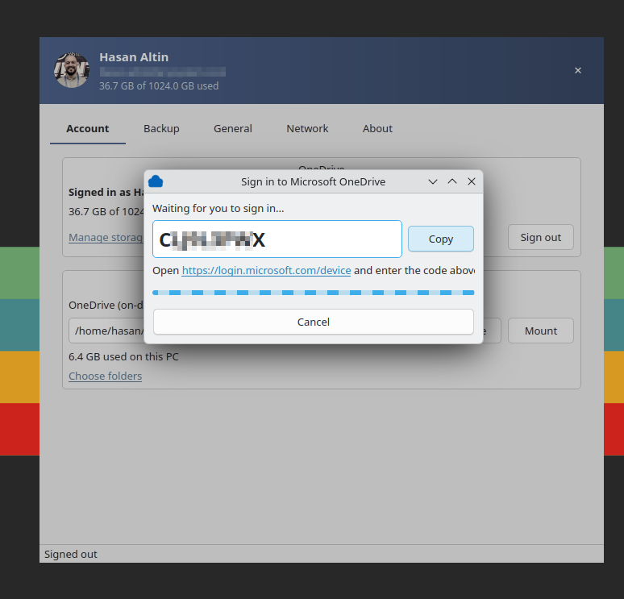</td>
<td width="50%"><b>Enter code (browser)</b><br>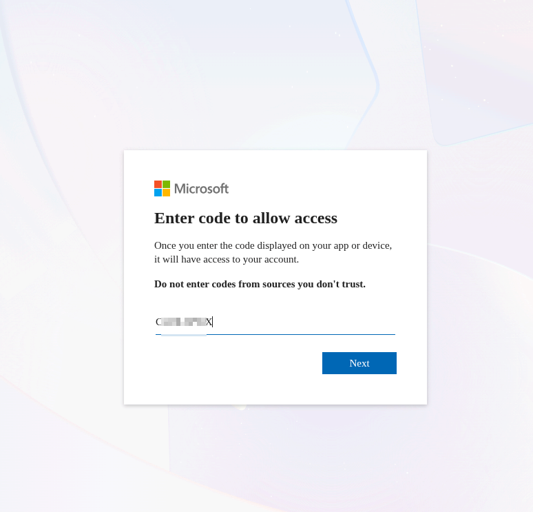</td>
</tr>
<tr>
<td><b>Account</b><br>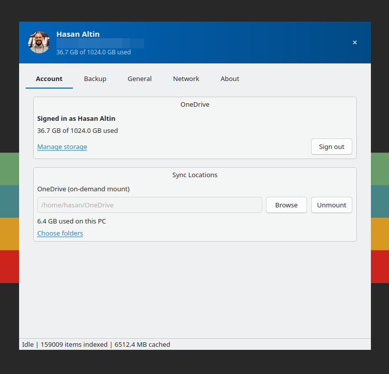</td>
<td><b>Backup (Folder Pairs)</b><br>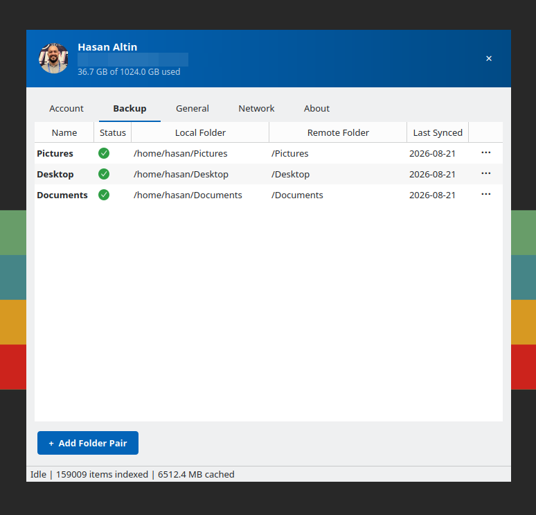</td>
</tr>
<tr>
<td><b>The mount, browsed in a file manager</b><br>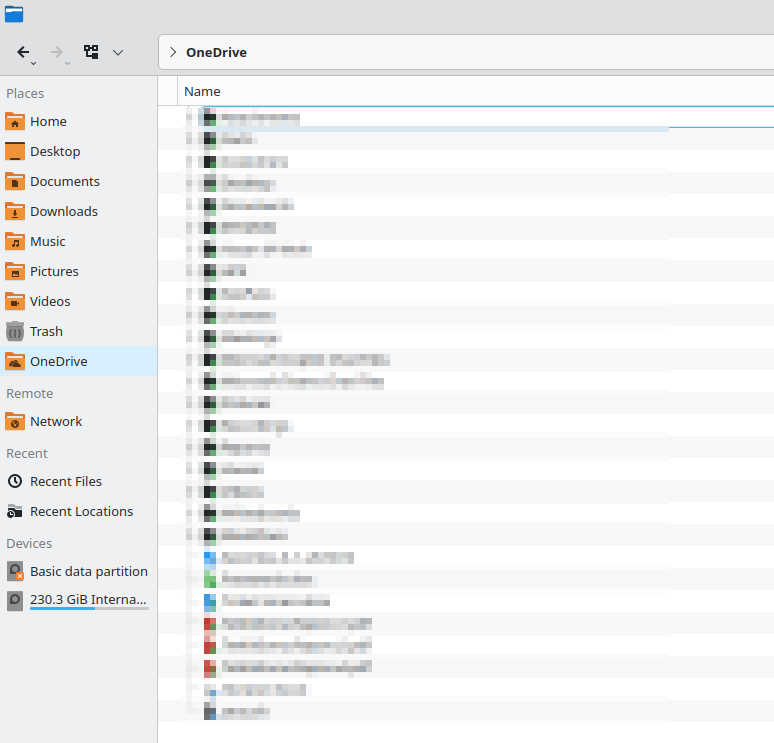</td>
<td><b>Add Folder Pair</b><br>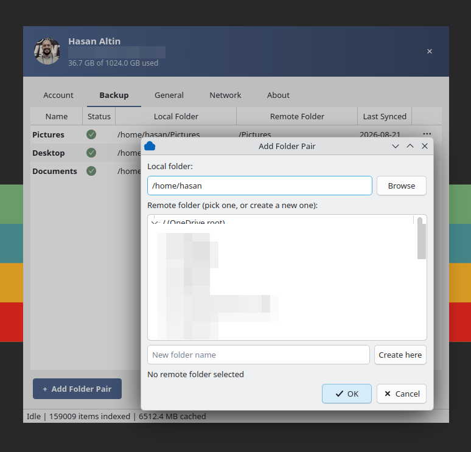</td>
</tr>
<tr>
<td><b>Choose folders (pinning)</b><br>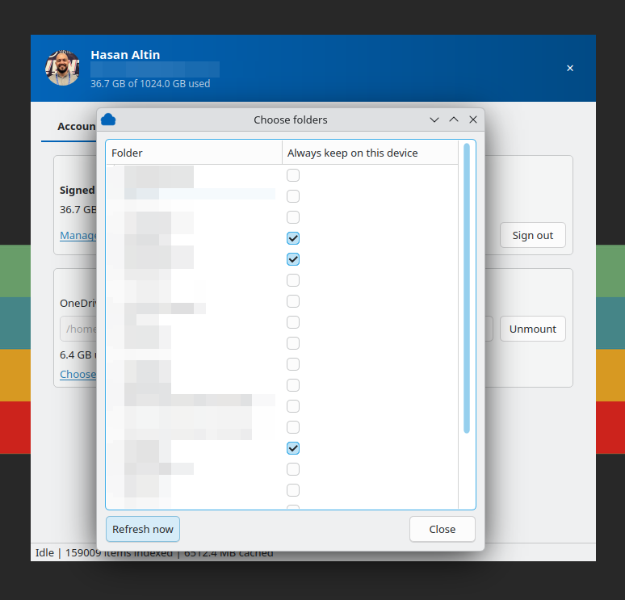</td>
<td><b>Tray activity popup</b><br>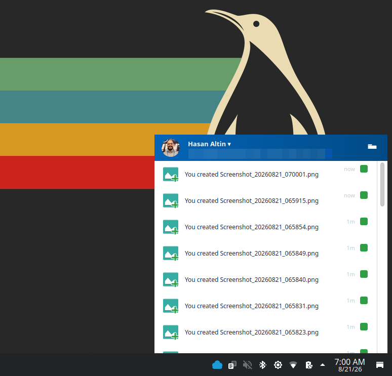</td>
</tr>
<tr>
<td><b>About</b><br>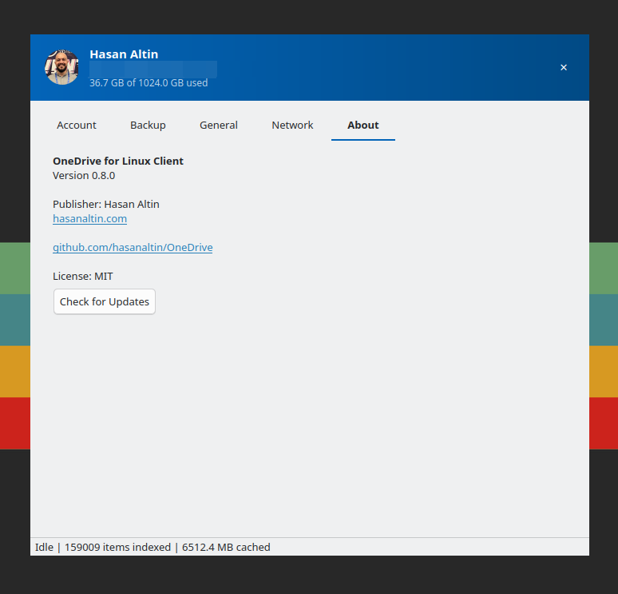</td>
<td></td>
</tr>
</table>

<details>
<summary>General and Network settings</summary>
<br>
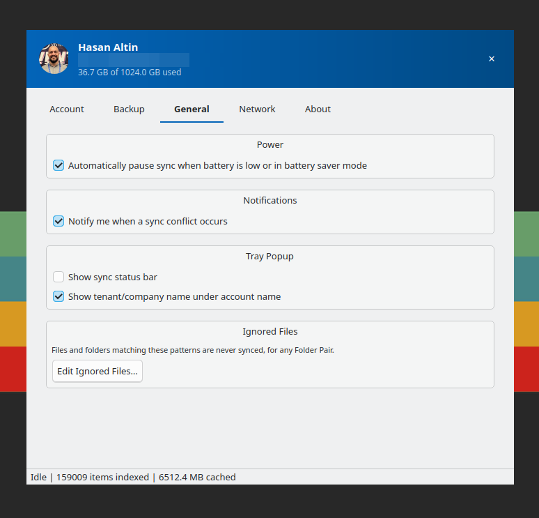 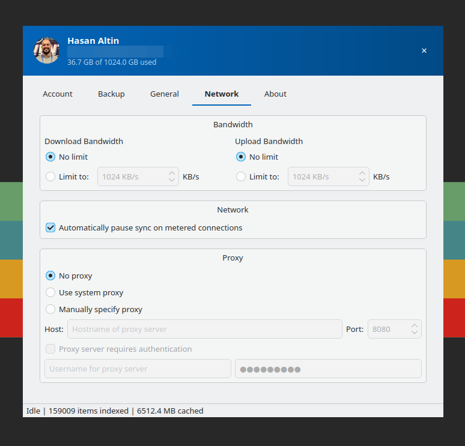
</details>

## Features

- **On-demand mount** (`~/OneDrive` by default) — the whole account browses instantly (metadata
  is cached locally and kept fresh in the background), file content only downloads when you
  actually open something.
- **Full read/write through the mount** — create, edit, rename, and delete files and folders
  directly in Dolphin/Nautilus/any app, changes upload automatically. Conflicting edits are never
  silently overwritten: both versions are kept (`... (conflicted copy ...)`) if the same file
  changed on both sides.
- **Folder Pairs** — pick a local folder and a remote OneDrive folder (unrelated name/location is
  fine) and get real two-way sync: local edits upload, remote edits download, deletes propagate
  both ways, with the same conflict-safe "keep both" guarantee. Supports exclude patterns (glob,
  e.g. `*.tmp`, `.sync_*.db*`) per pair.
- **"Always keep on this device" pinning** — mark specific folders in the on-demand mount to be
  eagerly downloaded and kept available offline, without needing a full Folder Pair.
- **System tray** with a Windows-OneDrive-style recent activity popup, auto-mount on login, and
  autostart.

## Requirements

- Linux with FUSE 3 (`fuse3` / `libfuse3-4`, present by default on most modern distros)
- Python 3.11+
- A Microsoft OneDrive account (personal or work/school)

## Installation

```bash
git clone https://github.com/hasanaltin/OneDrive.git onedrive
cd onedrive
./install.sh
```

This sets up the venv, installs dependencies, generates an app icon, adds an Applications menu
entry, and enables autostart on login — safe to re-run any time (e.g. after a `git pull`). Pass
`./install.sh --skip-autostart` to skip the login-autostart step. It doesn't sign in or launch the
app; that's still an interactive step (see Usage below).

## Setup: register your own Azure app (required, once)

This project ships with **no Azure app identity baked into the source** - every install
registers its own, so nobody's traffic runs through someone else's Azure tenant and the
Microsoft sign-in consent screen shows *your* app's identity, not a stranger's:

```bash
./register_azure_app.sh
```

This needs an account with Application Administrator or Global Administrator rights in whichever
Microsoft tenant you want the app registered in - your own personal Microsoft account's tenant
works fine too. It opens a browser for `az login`, creates a multi-tenant app registration (so any
Microsoft account can still sign in through it afterward, not just your own tenant), and writes
the resulting Client ID to `~/.config/OneDrive/client_id` - no source file editing needed.
The one remaining step it deliberately doesn't automate (to avoid guessing at Microsoft Graph
permission GUIDs) is granting API permissions, listed below; the script also prints these exact
steps at the end.

### Required Microsoft Graph API permissions

In [entra.microsoft.com](https://entra.microsoft.com) → App registrations → your app → **API
permissions** → **Add a permission** → **Microsoft Graph** → **Delegated permissions**, add these
four, then click **Grant admin consent**:

| Permission | Why this app needs it |
|---|---|
| `Files.ReadWrite` | Read/write access to the signed-in user's own OneDrive - the core permission behind the on-demand mount and Folder Pairs (create, edit, delete, move). |
| `Files.ReadWrite.All` | Same, extended to files the user doesn't own but has access to (items shared with them, SharePoint document libraries) - needed since this app addresses items by drive ID/item ID directly rather than only ever through `/me/drive`. |
| `User.Read` | Basic profile info (display name, email, profile photo) shown in the app's account/tray UI - no write access, no access to anyone else's profile. |
| `People.Read` | Backs the "search for a person" autocomplete in the Share dialog (Microsoft Graph's "relevant people" API) - lets you find a colleague by name/email when sharing a file. Granted at sign-in like the others; only actually exercised if you use Share. |

None of these are application-wide/admin-only permissions - all four are **delegated**, meaning
the app can only ever act as the signed-in user, with whatever access that user already has. No
permission here grants access to other users' files, mailboxes, or any data outside what the
signed-in account can already see in OneDrive. Per [Microsoft's own permissions
reference](https://learn.microsoft.com/en-us/graph/permissions-reference), none of these four are
classified as admin-only when delegated (as opposed to application/app-only permissions, which
this app doesn't use) - a personal Microsoft account can consent to all four itself. The "Grant
admin consent" step exists because many managed (work/school) tenants disable self-service user
consent entirely as a blanket policy, for *any* third-party app regardless of which specific
low-privilege permissions it requests - not because these particular four are unusually sensitive.

Until this is done, signing in from the app fails with a clear "No Azure app Client ID
configured" error.

## Usage

```bash
source .venv/bin/activate
python -m onedrive
```

Sign in via the device-code flow shown in the window, then use **Mount** to bring up the
on-demand `~/OneDrive` folder, and the **Folder Pairs** tab to set up any two-way synced folders.
You don't need to create the `~/OneDrive` folder yourself - clicking **Mount** creates it
automatically if it doesn't already exist, and it then shows up like any other folder in your file
manager (see the screenshot above).

## Troubleshooting

**Dolphin (KDE): "Cannot paste: You do not have permission to write into this folder" when
pasting into a subfolder of the `~/OneDrive` mount, even though copying the same file via a
terminal (`cp`) works fine.**

This is not a bug in this app - it's a known Plasma 6 / Dolphin regression affecting *any*
FUSE-mounted filesystem's subdirectories (the mount's own root folder is unaffected; only nested
folders are), reproducible with completely unrelated FUSE filesystems like sshfs too (see
[KDE bug 376344](https://bugs.kde.org/show_bug.cgi?id=376344) and reports on the
[Arch Linux forum](https://bbs.archlinux.org/viewtopic.php?id=294565)). Dolphin's "can I paste
here" check that decides whether to gray out the menu item is wrong; the actual write permission
on the folder was never restricted - confirmed directly against this project by copying the same
file into the same folder via `cp`, `gio copy`, and even Dolphin's own copy engine invoked
directly (`kioclient5 copy`), all of which succeeded while Dolphin's own Paste button stayed
grayed out.

Workarounds, until KDE fixes this upstream:
- Right-click the destination folder → **Open Terminal Here**, then `cp "source" "dest/"` -
  verified to work every time.
- Reportedly (not verified against this project specifically): creating a new subfolder inside
  the destination first and pasting into *that*, or using drag-and-drop instead of copy/paste,
  sometimes bypasses the same broken check.

**Dolphin (KDE): don't enable "Remote storage: Show previews for" (Configure Dolphin → General →
Previews) for anything under `~/OneDrive` - it silently downloads every visible file in full.**

This is not specific to any plugin this project ships or doesn't ship - it's how Dolphin's
built-in thumbnailers (images, PDF, Office documents, ...) behave for *any* file manager, they
just call `open()`/read the file normally to generate a preview, with no awareness that a FUSE
mount might be on-demand. The moment previews are enabled for remote storage (which is how Dolphin
classifies a FUSE mount, `~/OneDrive` included), opening a folder downloads every file needed to
thumbnail everything currently visible in it - confirmed live, this happens even without clicking
or selecting anything, just from the folder being open. A project attempt at a custom KIO
thumbnailer plugin to serve real OneDrive-generated thumbnails instead (0.4.89) turned out not to
be fixable: when multiple enabled thumbnail plugins claim the same mimetype, KIO's own
`previewjob.cpp` has no priority mechanism at all - whichever plugin its directory scan happens to
enumerate first silently wins forever, and the built-in ones reliably won ahead of a
freshly-installed one. See CHANGELOG.md's `[0.4.91]` entry for the full writeup; the plugin was
removed rather than left installed with this failure mode. Keep "Remote storage: Show previews
for" at its default "no file" for this mount.

## Verification scripts

`scripts/` has small standalone scripts (no test framework, just plain asserts) that exercise
the app against a real OneDrive account and a real FUSE mount — auth, on-demand download
behavior, Folder Pair upload/download/delete, and the conflict-preservation guarantee. See each
script's docstring for usage.

## Automated tests

`tests/` has a real `pytest` suite — no OneDrive account or FUSE mount needed. It covers
`onedrive/sync/reconcile.py` specifically: the pure three-way (local/remote/last-synced)
classification logic that decides what gets uploaded, downloaded, deleted, or flagged as a
conflict for every file in a Folder Pair. That's the single most consequential piece of logic in
this project (a wrong classification can overwrite or delete real files) and, unlike everything
else here, needs no live account to test — it's a deterministic function over three in-memory
maps. Everything else (actual Graph API calls, actual FUSE behavior) stays covered by the
`scripts/verify_*.py` scripts above instead.

```bash
source .venv/bin/activate
pip install -r requirements-dev.txt
pytest tests/
```

## Architecture

- `onedrive/graph_client.py` — Microsoft Graph API calls (delta sync, upload/download, create,
  delete, move/rename), with throttling retry and conflict (409/412) handling.
- `onedrive/db.py` — SQLite cache of remote metadata (kept fresh continuously via Graph's
  `/delta` endpoint) plus Folder Pairs' own tracking tables.
- `onedrive/fuse/` — the on-demand, read/write FUSE filesystem (built on `pyfuse3`).
- `onedrive/sync/` — background workers: metadata delta sync, pinned-folder downloader, and the
  Folder Pairs reconciler (a pure three-way local/remote/last-synced diff, covered by `tests/`).
- `onedrive/gui/` — PyQt6 interface: main window, tray + activity popup, Folder Pairs management.

## Contributing / development

Issues and pull requests are welcome. See `CHANGELOG.md` for what's landed so far.

## License

MIT — see `LICENSE`.

## Author

**Hasan Altin** — [hasanaltin.com](https://hasanaltin.com)
